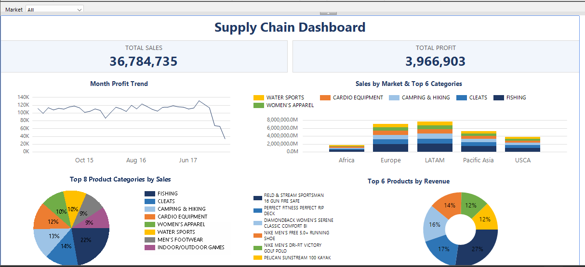

# Supply Chain Dashboard (SSRS / Power BI Report Builder)

A one-page paginated report built in **Report Builder** on an **Oracle XE** database, using the DataCo Supply Chain dataset. A **Market** parameter filters every visual and KPI on the page.



## What it shows
| Visual | Purpose |
|---|---|
| KPI cards | Total Sales and Total Profit for the selected market |
| Month Profit Trend (line) | Profit by month |
| Sales by Market & Top 6 Categories (stacked bar) | Market-wise sales split by the 6 largest categories |
| Top 8 Product Categories by Sales (pie) | Share of sales among the top 8 categories |
| Top 6 Products by Revenue (doughnut) | Share of revenue among the top 6 products |

Headline numbers (Market = All): **36.78M total sales, 3.97M total profit**. Europe alone: 10.87M sales, 1.17M profit.

## Tech
- Report Builder (.rdl, SSRS paginated report)
- Oracle XE (`Supply_Chain` table), SQL with a bind parameter (`:pMarket`)
- Report expressions, Top N group filters, parameter with "All" option

## Repository
```
report/SupplyChain_Dashboard.rdl   the report definition
sql_queries.sql                    the 3 dataset queries
screenshots/                       dashboard previews
```

## How to run
1. Load the dataset into an Oracle table named `Supply_Chain`.
2. Open `report/SupplyChain_Dashboard.rdl` in Report Builder.
3. Edit the data source `XE_LOCAL` (default `localhost:1521/xe`) and enter your credentials.
4. Click **Run** and pick a Market.

## Notes
- Percentages on the pie and doughnut are shares of the displayed Top N items, not of all sales.
- <!-- TODO: add a note here about data coverage of the latest months after verifying order counts per month -->
